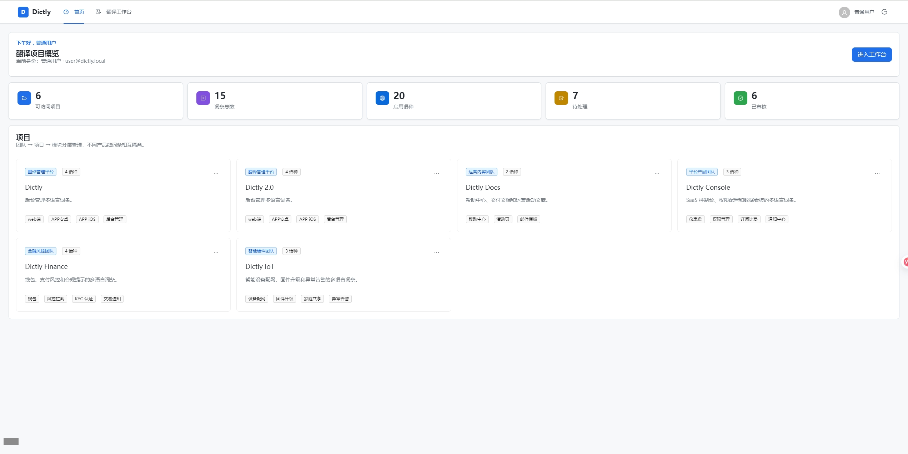
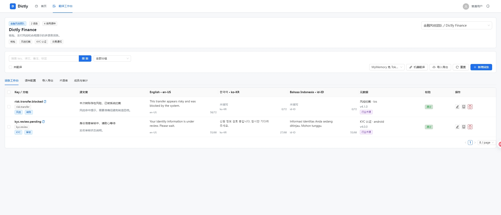
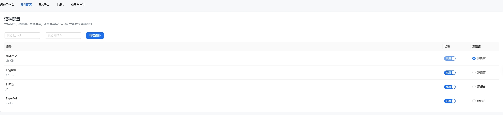
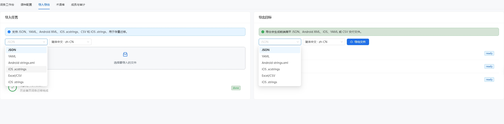
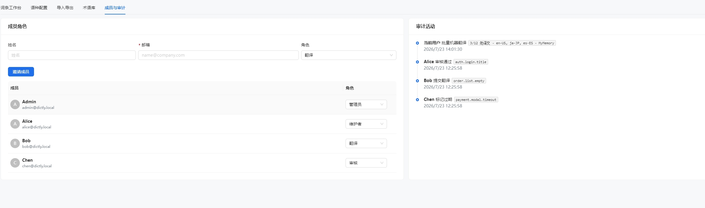

# Dictly

Dictly 是一个多语言翻译管理平台，用于多人协作维护项目词条，统一管理产品多语言文案词条，解决传统 Excel 散文件、翻译不一致、版本混乱、开发翻译割裂、无审核流程等痛点，打通产品 - 开发 - 翻译 - 运营协作链
路，实现词条集中存储、协作翻译、版本管控、一键导出工程资源、API/CDN 动态下发，支撑软件国际化（i18n）、跨境业务、多语种文档统一管理。

## 示例界面

#### 项目管理



#### 词条管理



#### 语种管理



#### 导入和导出



#### 权限管理



## 核心业务模块完整设计

-   项目分层：团队 → 项目 → 模块（如 web 端/APP 安卓/APP iOS/后台管理），隔离不同产品线词条。
-   语种配置：支持无限语种（zh-CN、en-US、ja-JP、es-ES 等），可启用 / 禁用、设置源语言（基准中文）。
-   支持翻译词条编辑、状态流转、协作成员角色和审计活动。
-   支持导入任务、导出目标和后续文件格式扩展。
-   词条分组：文件夹树形分类（auth.login、home.header、order.list），支持多层级 key 命名规范。
-   提供登录、首页 Dashboard 和翻译工作台三个核心入口，登录后进入首页查看问候语、个人信息和拥有或可访问的项目。
-   元数据标签：业务模块、终端类型、上线版本、行业术语、是否品牌固定文案。

## 技术栈

| 层级          | 技术                                                 |
| ------------- | ---------------------------------------------------- |
| 构建/任务工具 | Vite+，后续简称 `vp`                                 |
| 应用框架      | Nuxt 4                                               |
| 前端框架      | Vue 3.5，Composition API，`<script setup lang="ts">` |
| UI 组件       | Ant Design Vue 4，`@ant-design/icons-vue`            |
| 服务端        | Nuxt Nitro server routes                             |
| 类型系统      | TypeScript                                           |
| 自动化规范    | Trellis，规范入口在 `.trellis/spec/`                 |

> Vite+ 官方文档：https://viteplus.dev/guide/

## 命令约定

本项目统一通过 `vp` 运行本地开发任务。

```bash
vp install
vp run dev --host 127.0.0.1
vp run check
vp run build
vp run preview
```

说明：

-   `vp install` 负责安装依赖，底层按 `package.json` 的 `packageManager` 使用 pnpm。
-   `vp run dev` 执行 `nuxt dev`。
-   `vp run dev --host 127.0.0.1` 通过 HTTPS 启动本地服务；Nuxt 会生成本地自签证书，浏览器首次访问需要手动信任或继续访问。
-   `vp run build` 执行 `nuxt build`，因为 Nuxt 需要生成 Nitro/server 输出。
-   不直接用内置 `vp build` 构建 Nuxt 应用；内置 `vp build` 面向标准 Vite 应用。
-   `vp run check` 执行 `vp run nuxt:prepare && vp check && vp run typecheck`。
-   `vite.config.ts` 保留给 Vite+ 做检查、运行和缓存配置；Nuxt 运行时配置放在 `nuxt.config.ts`。

## 内置开发账号

当前登录模块先内置两个种子账号：

| 角色     | 账号    | 密码       |
| -------- | ------- | ---------- |
| 普通用户 | `user`  | `user123`  |
| 管理员   | `admin` | `admin123` |

登录接口会设置 `dictly_session` HttpOnly cookie。未登录访问 `/`、`/workspace` 以及业务 API 时会被要求登录或跳转到 `/login`。

## 导入和导出格式

支持导入格式用于存量迁移：

-   JSON
-   YAML
-   Android `strings.xml`
-   iOS `.xcstrings`
-   Excel/CSV
-   iOS `.strings`

支持导出格式：

-   Web 前端：标准扁平化 JSON
-   移动端：Android XML、iOS `.xcstrings`、iOS `.strings`、YAML
-   交付文档：Excel

## 自动化编程规范

-   所有 AI/自动化开发任务先阅读 `AGENTS.md` 和 `.trellis/spec/`。
-   项目级规范在 `.trellis/spec/project/index.md`。
-   前端规范在 `.trellis/spec/frontend/`，要求 Vue 3.5、Nuxt 4、Ant Design Vue 4、TypeScript。
-   后端规范在 `.trellis/spec/backend/`，要求 Nuxt server routes + SQLite3。
-   修改技术栈、目录结构、数据库 schema、命令约定时，必须同步 README 和 `.trellis/spec/`。
-   组件保持单一职责：页面只做组合，业务 UI 放在 `app/components/translation/`，状态和副作用放在 composable。
-   路由页如果引用嵌套目录组件，优先显式 `import`，避免依赖 Nuxt 嵌套组件自动命名。
-   Ant Design Vue 4 按组件注册时必须同时注册 `cssinjs.StyleProvider`，否则组件类名存在但运行时样式不会注入。
-   不引入额外数据库服务，除非后续任务明确调整架构。

## 当前功能

-   登录页 `/login`，支持普通用户和管理员内置账号登录。
-   首页 Dashboard `/`，显示问候语、个人信息、项目概览。
-   翻译工作台 `/workspace`，登录后可查看和维护翻译项目。
-   翻译项目切换。
-   locale、分组和搜索过滤。
-   翻译词条表格只读展示，目标译文按所有启用目标语种外显；点击操作进入抽屉表单编辑与保存。
-   导入任务进度展示。
-   导出目标状态展示。
-   成员角色和审计活动展示。
-   无业务数据 API 服务时暂时使用本地 mock 数据。
-   单条 / 批量增删改、批量复制、批量迁移分组、批量作废下线。
-   字符长度限制校验（移动端按钮、弹窗文案截断预警）。
-   全文检索：跨语种、key、备注、标签模糊搜索；筛选未翻译词条。
-   机器翻译：对接 MyMemory 免 Token 翻译服务，一键填充全语种，支持批量自动翻译；服务异常时回退到本地模拟翻译。
-   统一企业品牌、产品、技术术语，强制翻译遵循标准。
-   区分标准术语 / 禁用术语，编辑词条实时弹窗提示冲突。
-   点击新增时，自动生成 16 位的[数字+字母]唯一 key, 支持手动修改。

## 演示地址：

https://web-dictly.vercel.app/login?redirect=/
